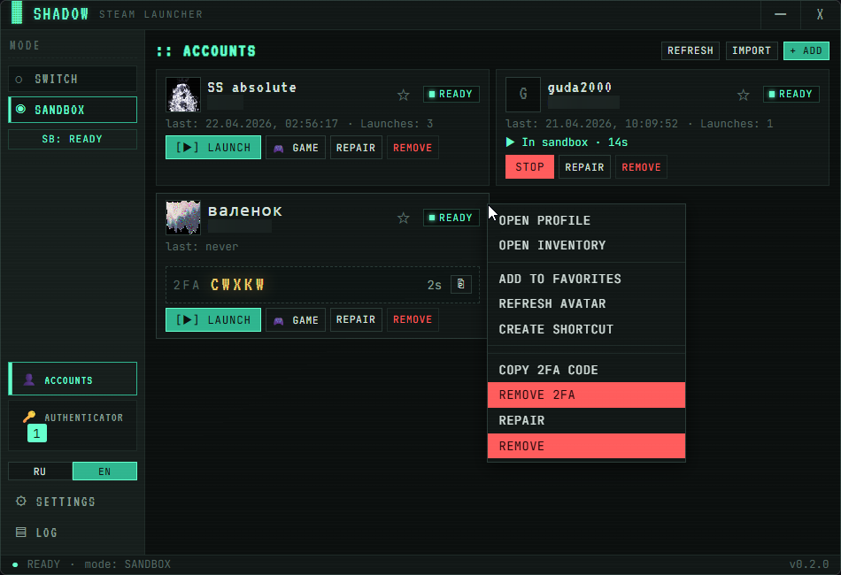
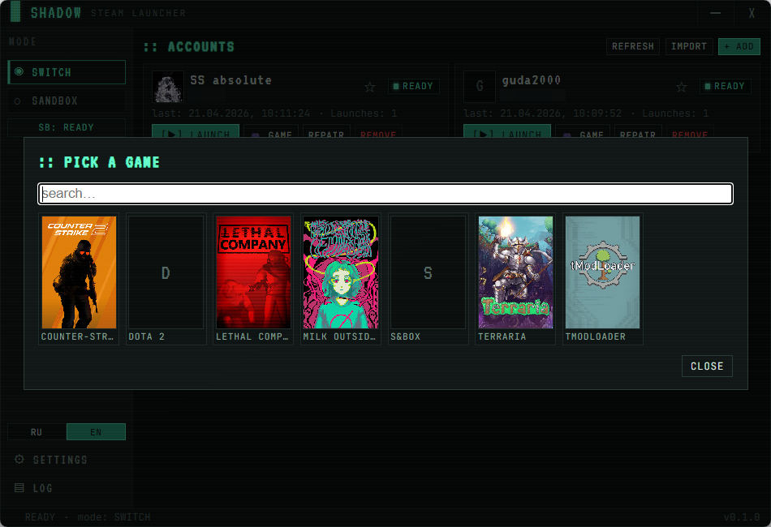
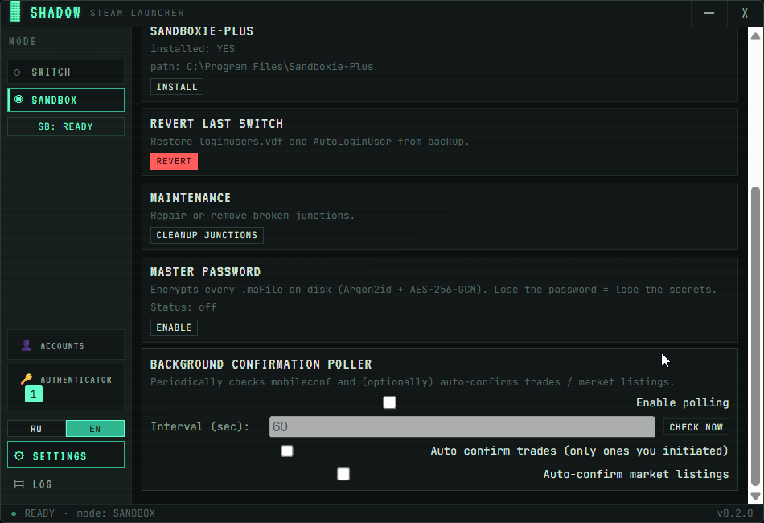

# Steam Shadow Launcher

Steam Desktop Autheticator + Account Switcher + Parrallel Multi Launcher with AiO Sandboxie and more!

[](LICENSE)


🇷🇺 **Русский** · [🇬🇧 English](#-english)

---

## Что умеет

- **Sandbox** — параллельный запуск нескольких клиентов Steam. Sandboxie ставится сам по клику.
- **Switch** — быстрое переключение между аккаунтами основным процессом Steam, без песка.
- **Вход без логинов/паролей** — авторизация по сохранённым сессиям с компа.
- **Запуск игры** — можно сразу стартовать игру с выбранного аккаунта, обложки подтягиваются из кэша Steam.
- **Ярлык на аккаунт** — `.lnk` для входа в конкретный профиль в один клик.
- **Бэкапы и откат** — перед свитчем сохраняются `loginusers.vdf` и ветки реестра. В случае чего есть кнопка «Revert last switch».
- **Красивый ✨ UI с анимациями** — а не вся блевотина, которая сейчас у конкурентов.
- **Портативная версия** — можно запускать как установленный, так и одним exe-файлом.

### Новое в v0.2.0 — Steam Desktop Authenticator внутри лаунчера

- **Свой Steam Guard прямо в приложении.** Коды TOTP генерируются рядом с карточкой аккаунта, как в SDA / steamguard-cli.
- **Импорт `.maFile`** из SDA / steamguard-cli одним кликом. Поддерживается и плейн, и зашифрованный формат.
- **Привязка нового Steam Guard** — мастер на 13 шагов: логин → диагностика → телефон (или email-Guard без телефона) → активация → revocation-код → сохранение. Мобильник для этого не нужен.
- **Автоподтверждение трейдов и market-листингов** в фоне. Исходящий трейд ушёл — через 15 секунд уже «accepted», без единого клика.
- **Мастер-пароль.** Все `.maFile` шифруются Argon2id + AES-256-GCM. Без пароля с диска их не прочитать.
- **Отвязка аутентификатора** по revocation-коду прямо из приложения.

## Скриншоты

<p align="center">
  <br>
  <em>Главный экран — карточки аккаунтов, переключатель режима, статус песочниц.</em>
</p>
<p align="center">
  <br>
  <em>Выбор игры — обложки из локального кэша, запуск в один клик.</em>
</p>
<p align="center">
  <br>
  <em>Настройки — workspace, путь к Steam, Sandboxie-Plus, откат свитча.</em>
</p>

## Установка

На странице [Releases](../../releases) — портативный `.exe`:

| Файл | Что это |
|---|---|
| `SteamShadowLauncher-v0.2.0-x64-portable.exe` | Один exe, никакой установки. Настройки лежат в `%APPDATA%\SteamShadowLauncher\`. |
| `SHA256SUMS.txt` | Контрольные суммы. |

Админ-права запрашиваются только когда реально нужны — для Sandbox-режима. Для Switch админка не требуется.

Sandboxie-Plus не идёт в комплекте: при первом переключении на Sandbox лаунчер сам скачивает и ставит свежий релиз с [sandboxie-plus/Sandboxie](https://github.com/sandboxie-plus/Sandboxie).

## SWITCH vs SANDBOX

|  | SWITCH | SANDBOX |
|---|---|---|
| Закрывает основной Steam | Да (graceful → `-shutdown` → kill) | Нет |
| Одновременная игра на двух аккаунтах | ❌ | ✅ |
| Перекачка игр | ❌ | ❌ (хостовый `steamapps` прокинут внутрь) |
| Админ-права | Нет | Да (UAC, с предупреждением) |
| EAC / BattlEye | ✅ | ⚠ Часть игр отказывается грузиться в песке |
| Зависимости | Нет | Sandboxie-Plus (~12 МБ, silent install) |

## Безопасность

- `loginusers.vdf` бэкапится в `<workspace>/backups/` перед каждым свитчем.
- Старое `HKCU\…\AutoLoginUser` сохраняется в `<workspace>/backups/registry-<ts>.json`.
- В настройках — кнопка **Revert last switch**: откатывает обе вещи атомарно.
- Пароли Steam не хранятся, не запрашиваются, не отправляются. Используется тот же auto-login токен, что и у самого Steam.
- `.maFile` можно зашифровать мастер-паролем (Argon2id с 64 МБ памяти + AES-256-GCM). Без пароля в процессе не раскрываются.
- `shared_secret`, `identity_secret`, `refresh_token` никогда не логируются. `revocation_code` показывается один раз на этапе привязки — дальше он тоже только на диске (в шифрованном виде, если включён мастер-пароль).

## Сборка из исходников

- Windows 10/11 x64
- [Rust stable](https://rustup.rs/) + MSVC build tools (VS 2022 Build Tools, workload «Desktop development with C++»)
- Node.js 20+

```powershell
git clone https://github.com/Shightrox/steam-shadow-launcher
cd steam-shadow-launcher
npm install
npm run tauri build
```

Артефакты — в `src-tauri/target/release/bundle/`.

## FAQ

**Забанят?** Нет. Лаунчер трогает только то, что и сам Steam трогает сотни раз в день: `loginusers.vdf` и `AutoLoginUser`. SAM / TcNo / Steam Account Manager используют тот же подход больше десяти лет. Steam Guard привязывается через те же публичные API, что и мобильное приложение Steam.

**А мобильник для Guard не нужен будет?** Нет. Можно привязать Guard прямо из лаунчера — получишь `.maFile`, коды будут генериться в интерфейсе.

**Steam Guard уже стоит на телефоне.** Либо сначала отвязываешь его в Steam, потом привязываешь через лаунчер, либо импортируешь существующий `.maFile` из SDA / steamguard-cli — оба рабочих варианта.

**Linux / macOS?** Нет, только Windows. Используются junction reparse points, драйвер Sandboxie, Win32-мьютексы Steam.

**Окно маленькое и не ресайзится.** Осознанно. Вся типографика рассчитана под 760×520.

## Благодарности

- [Sandboxie-Plus](https://sandboxie-plus.com/) — David Xanatos (GPLv3), вызывается внешним процессом, не линкуется в бинарник.
- [Tauri 2](https://tauri.app), [Vite](https://vitejs.dev), [Zustand](https://github.com/pmndrs/zustand).
- Шрифты VT323 и JetBrains Mono.
- Протокол Steam Mobile Authenticator реверсили [SDA](https://github.com/Jessecar96/SteamDesktopAuthenticator) и [steamguard-cli](https://github.com/dyc3/steamguard-cli). Код из этих проектов не копировался (GPL-3.0); использованы только описания endpoint'ов.

## Лицензия

[MIT](LICENSE).

---

## 🇬🇧 English

Steam account switcher and parallel launcher via Sandboxie-Plus. With a built-in Steam Guard — no mobile phone required.

### What it does

- **Sandbox mode** — run multiple Steam clients in parallel. Sandboxie installs itself on first click.
- **Switch mode** — fast account switching via the main Steam process, no sandbox required.
- **Login without passwords** — reuses saved sessions from the machine.
- **One-click game launch** from any account, with library covers from local Steam cache.
- **Per-account desktop shortcuts** — `.lnk` boots the launcher in headless mode and starts the chosen profile.
- **Backups & rollback** — `loginusers.vdf` and registry snapshots are saved before every switch, with a one-click «Revert last switch».
- **Pixel-art UI with animations** — chromeless 760×520, EN/RU.
- **Portable build** — single `.exe`, no installer required.

### New in v0.2.0 — built-in Steam Desktop Authenticator

- **Steam Guard TOTP codes** generated inline on each account card.
- **Import `.maFile`** from SDA / steamguard-cli, plain or encrypted.
- **Enroll a fresh authenticator** via a 13-phase wizard: login → diagnose → phone (or email-Guard, no phone) → activation → revocation code → save. Your mobile phone is not required.
- **Auto-confirm** outgoing trades & market listings in the background.
- **Master password** — all `.maFile`s encrypt with Argon2id + AES-256-GCM at rest.
- **Revoke authenticator** from inside the app using your revocation code.

### Install

Grab the portable exe from [Releases](../../releases):

| File | Notes |
|---|---|
| `SteamShadowLauncher-v0.2.0-x64-portable.exe` | Single exe. Settings live in `%APPDATA%\SteamShadowLauncher\`. |
| `SHA256SUMS.txt` | Checksums. |

UAC is only requested when actually needed (Sandbox mode). Switch mode works without admin.

### SWITCH vs SANDBOX

|  | SWITCH | SANDBOX |
|---|---|---|
| Closes current Steam | Yes | No |
| Simultaneous play | ❌ | ✅ |
| Re-download games | ❌ | ❌ (host `steamapps` mounted) |
| Admin required | No | Yes |
| EAC / BattlEye | ✅ | ⚠ Some titles refuse to load inside a sandbox |
| External deps | None | Sandboxie-Plus (~12 MB, silent install) |

### Safety

- `loginusers.vdf` + registry snapshot backed up before every switch.
- Settings → **Revert last switch** restores both atomically.
- No Steam passwords stored, requested, or transmitted — only the auto-login token Steam itself uses.
- `.maFile`s can be sealed under a master password (Argon2id 64 MiB + AES-256-GCM).
- `shared_secret` / `identity_secret` / `refresh_token` never appear in logs. `revocation_code` is shown once during enrollment.

### Build from source

```powershell
git clone https://github.com/Shightrox/steam-shadow-launcher
cd steam-shadow-launcher
npm install
npm run tauri build
```

### FAQ

**Will Steam ban me?** No. The launcher only edits files Steam itself edits. Steam Guard uses the same public APIs as the official mobile app.

**Do I need a phone for Steam Guard?** No — enroll a fresh authenticator from inside the launcher, or import an existing `.maFile`.

**Linux / macOS?** Windows-only.

### Credits

- [Sandboxie-Plus](https://sandboxie-plus.com/) by David Xanatos (GPLv3).
- [Tauri 2](https://tauri.app), [Vite](https://vitejs.dev), [Zustand](https://github.com/pmndrs/zustand).
- Steam Mobile Authenticator protocol reverse-engineered by [SDA](https://github.com/Jessecar96/SteamDesktopAuthenticator) and [steamguard-cli](https://github.com/dyc3/steamguard-cli). No code copied (both are GPL-3.0) — only endpoint descriptions.

### License

[MIT](LICENSE).
