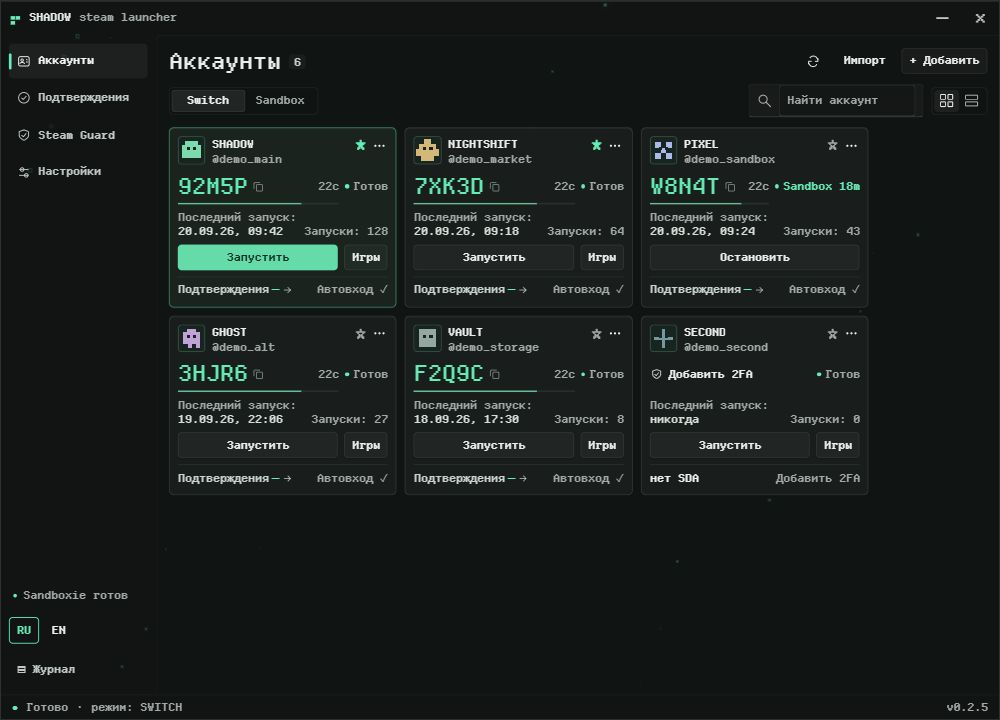
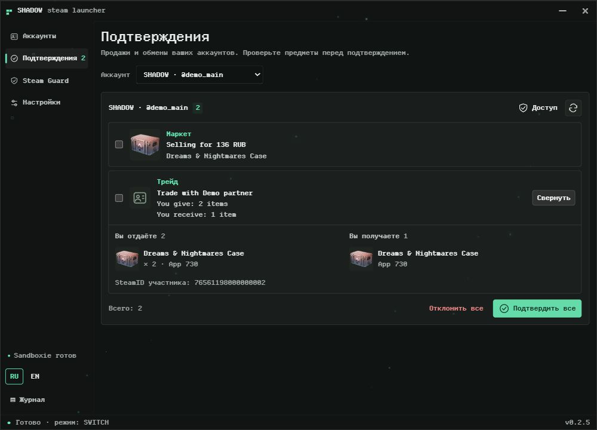
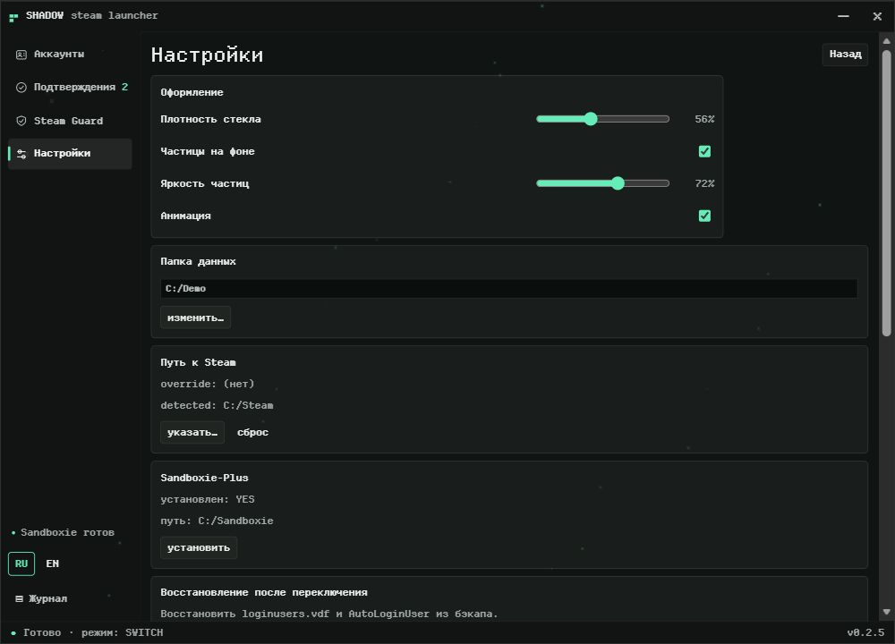

# Steam Shadow Launcher

Steam account switcher, parallel launcher and desktop authenticator for Windows.

[](LICENSE)


[](https://tauri.app)

**Русский** · [English](#english) · [Releases](https://github.com/Shightrox/steam-shadow-launcher/releases)

Компактные плитки аккаунтов, Steam Guard и запуск Steam в одном окне. Тёмный интерфейс с зелёными акцентами, пиксельным шрифтом, полупрозрачными панелями и плавными частицами на фоне.

## Скриншоты v0.2.5

Текущий интерфейс приложения с демонстрационными аккаунтами и операциями. Коды и идентификаторы на снимках вымышлены.





<details>
<summary>Настройки оформления</summary>



</details>

## Возможности

- **Аккаунты и 2FA рядом.** Аватар, код с таймером и копированием, последний запуск, число запусков, избранное и состояние сессии внутри плитки. Есть поиск и режим списка.
- **Switch.** Переключение основного Steam на выбранный аккаунт с использованием сохранённой авторизации.
- **Sandbox.** Дополнительные клиенты Steam через Sandboxie-Plus, состояние песочниц и остановка выбранного клиента. Установка Sandboxie доступна из приложения.
- **Игры и ярлыки.** Запуск установленной игры с выбранного аккаунта, обложки из кэша Steam и создание ярлыка аккаунта.
- **Steam Guard.** Импорт и экспорт `.maFile`, локальная генерация кодов, мастер привязки нового аутентификатора и продолжение незавершённой привязки.
- **Подтверждения.** Общая очередь продаж и обменов, фильтр по аккаунту, изображения предметов, раскрываемые списки «Вы отдаёте / Вы получаете», подтверждение или отклонение выбранных операций.
- **Восстановление сессии.** Обновление токена; при необходимости — вход с сохранённым паролем и автоматическая отправка Steam Guard. Если Steam требует дополнительную проверку, приложение предлагает ручной вход.
- **Фоновый опрос.** Настраиваемый интервал и отдельные переключатели автоподтверждения исходящих обменов и продаж. Автоподтверждение по умолчанию выключено.
- **Оформление.** Плотность стекла, яркость частиц и анимация настраиваются. Размер окна можно менять; поддерживаются русский и английский языки.
- **Восстановление после переключения.** Согласованные бэкапы Steam, откат последнего переключения и обслуживание папки `backups`.

## Установка и первый запуск

Готовые сборки находятся в [Releases](https://github.com/Shightrox/steam-shadow-launcher/releases). Скачайте `SteamShadowLauncher-v<version>-x64-portable.exe`; контрольные суммы публикуются в `SHA256SUMS.txt`.

**Исходники и скриншоты в `main` — v0.2.5. Последняя опубликованная сборка — v0.2.3; для нового интерфейса пока нужна сборка из исходников.**

1. Запустите приложение и выберите папку данных (workspace).
2. Импортируйте аккаунты, сохранённые в локальном Steam, или добавьте аккаунт вручную. Если Steam больше не принимает сохранённую сессию, потребуется повторный вход.
3. Выберите **Switch** для переключения основного Steam или **Sandbox** для параллельного запуска. Для Sandbox приложение предложит установить Sandboxie-Plus и запросит права администратора.
4. Для 2FA импортируйте `.maFile` или откройте мастер в разделе **Steam Guard**. Привязка может потребовать проверку почты или телефона со стороны Steam.

Portable-сборка не требует установки лаунчера. Настройки хранятся в `%APPDATA%\SteamShadowLauncher\`, данные аккаунтов — в выбранной папке workspace. Sandboxie-Plus устанавливается отдельно и не входит в `.exe` лаунчера.

### Switch и Sandbox

| | Switch | Sandbox |
|---|---|---|
| Основной Steam | Завершается и запускается с выбранным аккаунтом | Продолжает работать |
| Несколько клиентов одновременно | Нет | Да |
| Уже установленные игры | Используются напрямую | Доступны через общую библиотеку Steam |
| Права администратора | Не требуются | Требуются |
| Дополнительная зависимость | Нет | Sandboxie-Plus |

Совместимость игры с Sandbox зависит от её защиты и античита. Лаунчер не снимает ограничения Steam или самой игры.

## Пароли, секреты и бэкапы

- **Мастер-пароль** шифрует хранилище `.maFile` с помощью Argon2id и AES-256-GCM. Без включённого мастер-пароля файлы хранятся открыто. Закрытое хранилище нужно разблокировать перед работой с 2FA и подтверждениями.
- **«Запомнить пароль»** доступно при входе в Authenticator. После успешного входа пароль сохраняется отдельно от `.maFile`, под защитой Windows DPAPI текущего пользователя. Он используется для входа в Steam, не включается в экспорт `.maFile` и удаляется кнопкой **«Забыть сохранённый пароль»**. Переноса workspace недостаточно для переноса такого пароля на другой компьютер или профиль Windows.
- **Автовход** сначала пытается обновить токен. Сохранённый пароль и доступные секреты Steam Guard позволяют повторить вход автоматически; неверный пароль или дополнительная проверка Steam приостанавливают этот процесс.
- **Удаление аутентификатора из лаунчера** удаляет его локальную копию. Для отключения Steam Guard на аккаунте используйте Steam. Сохраните код восстановления и резервную копию `.maFile` в надёжном месте.
- **`<workspace>/backups/`** хранит `loginusers.vdf` и `AutoLoginUser` вместе в точке восстановления. Сохраняются до 10 последних точек; повтор текущего состояния не создаёт новую копию. Старые парные бэкапы преобразуются, лишние служебные файлы очищаются. Непарные и посторонние файлы сохраняются.
- В **Настройках** доступны откат последнего переключения и **«Упорядочить backups»**.

## Сборка из исходников

Нужны Windows 10/11 x64, Node.js 20+, [Rust stable](https://rustup.rs/) и MSVC Build Tools с компонентом **Desktop development with C++**.

```powershell
git clone https://github.com/Shightrox/steam-shadow-launcher.git
cd steam-shadow-launcher
npm ci
npm run tauri build -- --no-bundle
```

Исполняемый файл: `src-tauri/target/release/steam-shadow-launcher.exe`.

Для установщиков выполните `npm run tauri build`; они появятся в `src-tauri/target/release/bundle/`. Режим разработки: `npm run tauri dev`.

### Проверки

```powershell
npm test
npm run build
cargo test --locked --manifest-path src-tauri/Cargo.toml -- --test-threads=1
```

Для просмотра собранного интерфейса с искусственными ответами Tauri:

```powershell
npm run build
python tests/ui/serve.py
```

Откройте `http://127.0.0.1:18743/showcase.html`. Этот стенд используется для скриншотов, не обращается к локальным аккаунтам и не выполняет операции в Steam. Изображения предметов загружаются с публичного CDN Steam. [Как обновить снимки](docs/screenshots/README.md).

История исправлений и проверок: [ревью и исправления](docs/review-2026-09-19/FIXES.md), [интерфейс v0.2.5](docs/review-2026-09-19/FLUENT-IMPLEMENTATION.md). Реальные сделки и совместимость всех игр с Sandboxie не входят в автоматические тесты.

## Благодарности и лицензия

- [Sandboxie-Plus](https://sandboxie-plus.com/) — внешний компонент для песочниц, GPLv3.
- [Tauri 2](https://tauri.app), [React](https://react.dev), [Vite](https://vite.dev), [Zustand](https://github.com/pmndrs/zustand).
- [Departure Mono](https://departuremono.com/) — пиксельный шрифт Helena Zhang, [SIL Open Font License](src/assets/DepartureMono-LICENSE.txt). Включён локально, без загрузки из Google Fonts.
- [Steam Desktop Authenticator](https://github.com/Jessecar96/SteamDesktopAuthenticator) и [steamguard-cli](https://github.com/dyc3/steamguard-cli) — материалы о протоколе Steam Mobile Authenticator.

Лицензия лаунчера — [MIT](LICENSE). Независимый проект, не связанный с Valve.

---

## English

Steam Shadow Launcher combines Steam account switching, parallel clients via Sandboxie-Plus and a desktop Steam Guard authenticator. Compact account tiles keep avatars, 2FA codes and launch history together. The dark interface uses green accents, a bundled pixel font, translucent panels and adjustable background particles.

### Current version and screenshots

The source in `main` and the screenshots above show **v0.2.5**. The latest published binary is **v0.2.3**; build from source to use the updated interface. All screenshot accounts, codes and operations are synthetic.

- [Accounts and inline 2FA](docs/screenshots/accounts-v025.jpg)
- [Market confirmations and both sides of a trade](docs/screenshots/confirmations-v025.jpg)
- [Appearance settings](docs/screenshots/settings-v025.jpg)

### Features

- **Switch / Sandbox:** switch the main Steam client or run additional clients through Sandboxie-Plus. Reuse installed games, launch a game directly and create account shortcuts.
- **Compact account tiles:** avatars, 2FA code and timer, copy action, last launch, launch count, favorites, session state and sandbox controls. Search and list view are available.
- **Steam Guard:** `.maFile` import/export, locally generated codes, enrollment wizard and recovery of unfinished enrollment.
- **Confirmations:** a shared queue with account filtering, item images, expandable give/receive lists and bulk approval or rejection.
- **Session recovery:** refresh the token first, then use an optionally saved password and Steam Guard to sign in again. Additional Steam challenges require manual input.
- **Background polling:** adjustable interval and separate auto-confirm options for outgoing trades and market listings. Auto-confirm is off by default.
- **Appearance:** adjustable glass density, particle brightness and motion; resizable window; Russian and English UI.
- **Backups:** paired Steam restore points, rollback and cleanup of legacy backup files.

### Install and start

Download `SteamShadowLauncher-v<version>-x64-portable.exe` from [Releases](https://github.com/Shightrox/steam-shadow-launcher/releases). Checksums are provided in `SHA256SUMS.txt`.

Choose a workspace, then import accounts saved in the local Steam client or add an account manually. Steam may ask you to sign in again if its saved authorization has expired. Select **Switch** to restart the main client under another account, or **Sandbox** to launch an additional client. Sandbox requires administrator privileges and a separate Sandboxie-Plus installation, available through the app. Some games and anti-cheat systems do not support sandboxed execution.

Import a `.maFile` or use the **Steam Guard** enrollment wizard for 2FA. Steam may require email or phone verification during enrollment.

The portable launcher stores settings in `%APPDATA%\SteamShadowLauncher\` and account data in your chosen workspace.

### Data and recovery

The optional master password encrypts `.maFile` storage with Argon2id and AES-256-GCM. Without it, these files remain unencrypted. Unlock the vault before generating codes, recovering sessions or handling confirmations.

An optionally remembered Steam password is saved only after successful authentication, separately from `.maFile`, protected by Windows DPAPI for the current user. It is excluded from `.maFile` exports and can be removed with **Forget saved password**. Moving the workspace alone does not transfer that password to another Windows profile or computer.

Removing an authenticator from the launcher removes its local copy; disabling Steam Guard on the account must be done in Steam. Keep your recovery code and a backup of the `.maFile` safe.

`<workspace>/backups/` retains up to 10 restore points, each containing `loginusers.vdf` and `AutoLoginUser`. Repeated identical states are skipped. Legacy pairs are migrated; unpaired and unrelated files are preserved. Rollback and cleanup are available in Settings.

### Build and verify

Requirements: Windows 10/11 x64, Node.js 20+, Rust stable and MSVC Build Tools with **Desktop development with C++**.

```powershell
git clone https://github.com/Shightrox/steam-shadow-launcher.git
cd steam-shadow-launcher
npm ci
npm run tauri build -- --no-bundle
```

Binary: `src-tauri/target/release/steam-shadow-launcher.exe`. Use `npm run tauri build` for installers in `src-tauri/target/release/bundle/`, or `npm run tauri dev` for development.

Run `npm test`, `npm run build` and `cargo test --locked --manifest-path src-tauri/Cargo.toml -- --test-threads=1` for automated checks. Live trades and compatibility with every sandboxed game are not covered by these tests.

For the synthetic screenshot fixture, run `npm run build`, then `python tests/ui/serve.py`, and open `http://127.0.0.1:18743/showcase.html`. It does not access local Steam accounts or perform Steam operations; item images load from Steam's public CDN.

### Credits and license

Built with Tauri, React, Vite and Zustand; Sandboxie-Plus provides the external sandbox component. Departure Mono by Helena Zhang is bundled under the [SIL Open Font License](src/assets/DepartureMono-LICENSE.txt). SDA and steamguard-cli provide reference material on the authenticator protocol.

[MIT](LICENSE). An independent project, not affiliated with Valve.
